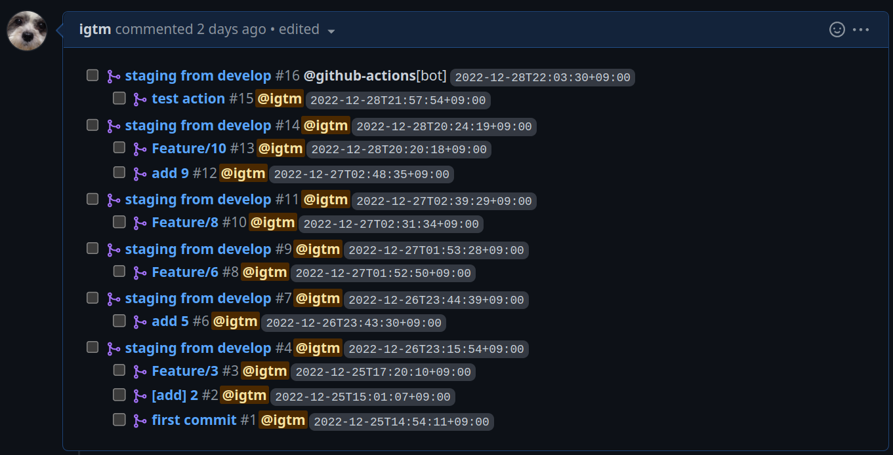

# create-release-pr

Auto PullRequest generation tool for Git Flow



# Installation

### curl

```sh
sudo curl -sfL https://raw.githubusercontent.com/igtm/create-release-pr/master/install.sh | sudo sh -s -- -b=/usr/local/bin
```

# Usage

```
Usage: create-release-pr --base <BASE> --head <HEAD>

Options:
      --base <BASE>  base branch of pull request
      --head <HEAD>  head branch of pull request
  -h, --help         Print help information
  -V, --version      Print version information
```

# TODO

- [x] nested pr comment
- [ ] auto merge
  > > > > > > > f562acf (initial commit)
